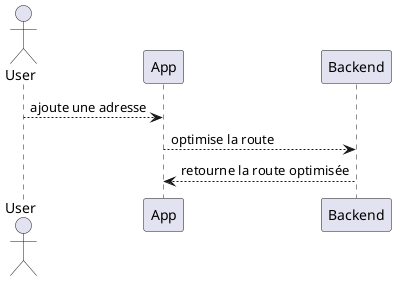

# Diagrams - NextStop App

Ce dossier contient les diagrammes PlantUML du projet NextStop.

## Structure suggérée

- `use-cases/` — Diagrammes de cas d'utilisation
- `class/` — Diagrammes de classes
- `sequence/` — Diagrammes de séquence
- `component/` — Diagrammes de composants

## Comment utiliser PlantUML

Les fichiers ont l'extension `.puml` ou `.plantuml`.

Exemple d'un fichier PlantUML :

